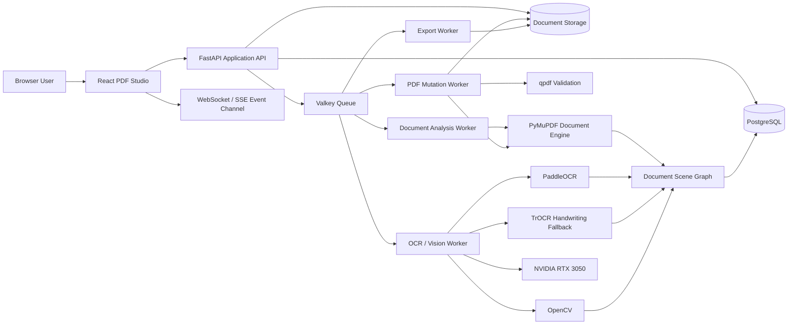
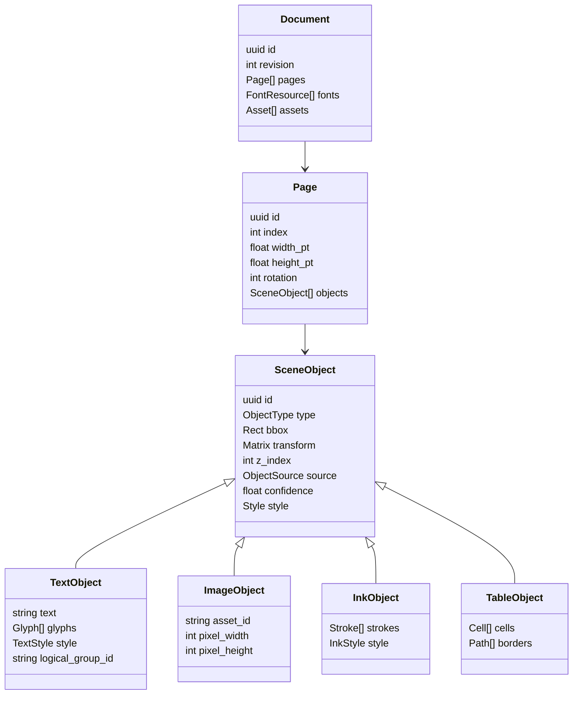
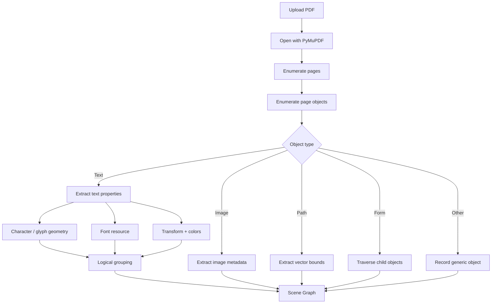
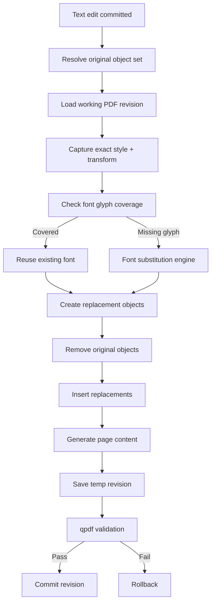
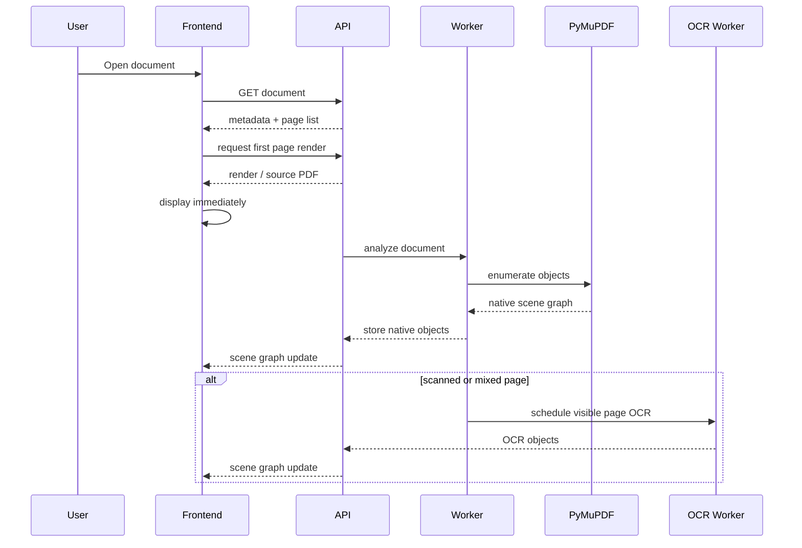
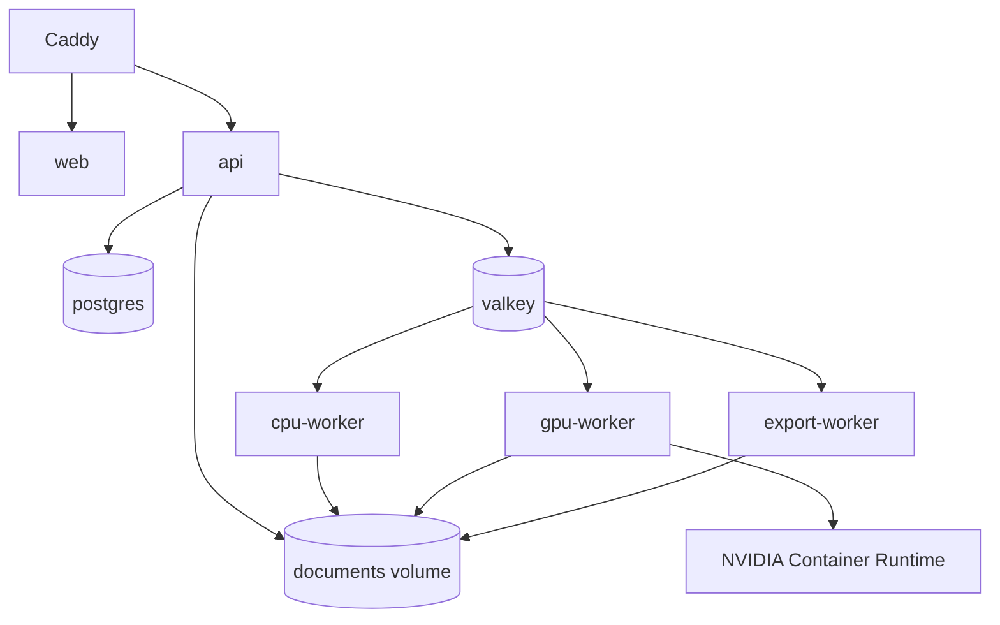
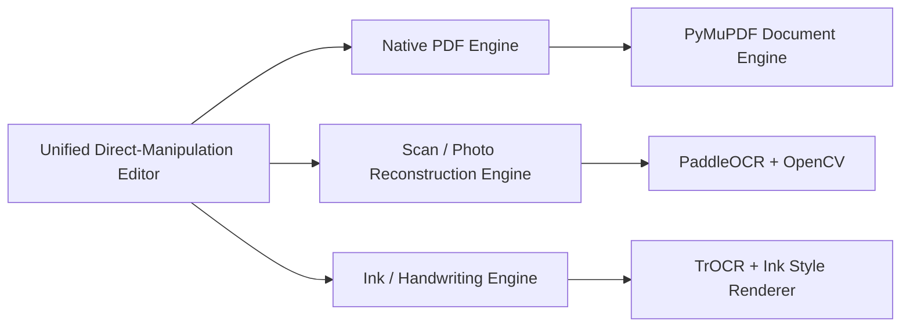

# ConvertVault PDF Studio — Flagship Self-Hosted PDF Editor Architecture

**Architecture version:** 2.0  
**Status:** Authoritative implementation specification  
**Date:** 2026-10-06  
**Deployment model:** Private internal self-hosting only  
**Primary server profile:** Linux + NVIDIA RTX 3050 4 GB VRAM  
**Design goal:** Build an advanced Acrobat-class editor in which the page itself is the editing surface. Users click visible content, edit in place, retain the original visual style automatically, and save a trustworthy PDF without understanding PDF internals, OCR objects, layers, or replacement forms.

**Implementation rule:** This document defines one flagship stack. Do not introduce parallel PDF engines, optional competing OCR stacks, or alternative architectural paths unless a later architecture revision explicitly changes this specification.

---

# 1. Product Vision

ConvertVault PDF Studio should behave like a professional desktop PDF editor rather than a PDF inspection/debugging tool. It is designed as a private internal self-hosted flagship application and should prioritize capability, fidelity, responsiveness, and maintainability.

The central interaction model is:

> **See it → click it → edit it → save it.**

The application must hide implementation details such as native text object lists, OCR bounding-box lists, object IDs, font-resource names, content streams, and replacement fields unless the user explicitly opens a developer/debug panel.

The same editor surface should work for:

- Computer-generated PDFs with real text objects.
- Scanned PDFs containing only images.
- Mobile-camera photos converted to PDF.
- Mixed PDFs containing both native text and scanned pages.
- Invoices containing tables, logos, barcodes, stamps, signatures, handwritten notes, and printed text.
- PDFs containing native annotations and ink strokes.
- PDFs whose original fonts are embedded as subsets.
- PDFs containing rotated or transformed text.
- Pages with skew, perspective distortion, shadows, uneven lighting, and noise.

The application should feel immediate. OCR and document analysis are backend implementation details, not separate workflows the user has to manage.

---

# 2. Problems in the Current Prototype

Based on the current prototype UI, the editor is exposing the document model rather than enabling direct manipulation.

## Current problems

1. **Text editing is detached from the page.**
   - The right panel lists native text objects.
   - The user must identify an object in a list and type replacement text elsewhere.
   - This breaks visual context.

2. **The document canvas is visually secondary.**
   - A large amount of screen space is occupied by navigation and inspectors.
   - The actual page is comparatively small.
   - There is excessive dead grey space below the page.

3. **Object counts are developer-oriented.**
   - “Native text objects (350)”, font counts, image counts, link counts, and similar details are useful for debugging but not for normal editing.

4. **The right sidebar is overloaded.**
   - Comments, text replacement, native objects, images, and other controls compete simultaneously.

5. **No direct object manipulation.**
   - The user should not have to search for `VISHNU`, `MEDICAL`, or `.HALL` in a side panel.
   - They should click the visible word on the page.

6. **Page navigation is detached from normal editor conventions.**
   - Bottom floating page buttons consume canvas space and are not ideal for multi-page editing.

7. **The application shell remains too prominent inside the editor.**
   - Convert, Library, PDF Studio, Jobs, Admin are application-level navigation.
   - Once a document is open, editing should become the dominant experience.

8. **No clear editing modes.**
   - Text, image, crop, annotation, OCR, page organization, and forms need distinct tools but should share one canvas.

9. **No confidence model for OCR.**
   - Scanned text should become directly editable when confidence is high.
   - Only uncertain recognition should require user attention.

10. **No unified internal document scene graph.**
    - Native text, OCR text, images, vectors, tables, and ink need one coordinate system and one interaction model.

---

# 3. UX Design Principles

## 3.1 Direct manipulation

A click on visible page content must target the visible object.

Normal interaction:

- Single click: select object.
- Double click: enter text editing at the clicked character.
- Triple click: select line or paragraph.
- Drag: select text or move selected object depending on active tool.
- `Alt + click`: cycle through overlapping objects.
- `Esc`: exit current edit and return to selection.
- `Ctrl/Cmd + Z`: undo.
- `Ctrl/Cmd + Shift + Z`: redo.

The user should never need to know whether the target came from:

- PDF native text,
- OCR,
- an annotation appearance stream,
- a raster reconstruction,
- a table cell,
- or a handwriting/ink object.

That decision belongs to the engine.

## 3.2 Context over panels

Controls should appear because of the current selection.

Examples:

- Select text → typography toolbar appears.
- Select image → image toolbar appears.
- Select ink → stroke toolbar appears.
- Select table → table controls appear.
- No selection → inspector collapses to document properties.

## 3.3 Progressive disclosure

Advanced controls should remain available but hidden until needed.

Normal user:
- sees edit, annotate, pages, OCR, fill/sign, export.

Advanced user:
- can open object inspector, OCR confidence overlay, content-stream diagnostics, font-resource inspector, and object IDs.

## 3.4 Preserve visual fidelity

The default editing policy is:

> Preserve original appearance unless the user explicitly changes formatting.

If the user replaces text, the system should automatically preserve:

- font family,
- font size,
- weight,
- italic state,
- text color,
- stroke color,
- character spacing,
- word spacing,
- line height,
- baseline,
- rotation,
- transform,
- opacity,
- rendering mode,
- local alignment,
- approximate kerning,
- and surrounding geometry.

## 3.5 Non-destructive workflow

Never mutate the only copy of an uploaded document.

Maintain:

- original file,
- working revision,
- operation log,
- autosave snapshots,
- exported versions.

---

# 4. Proposed Editor UI

## 4.1 Desktop layout

```text
┌──────────────────────────────────────────────────────────────────────────────┐
│ ConvertVault    File  Edit  View               filename.pdf        Save ▾   │
├──────────────────────────────────────────────────────────────────────────────┤
│ Select  Edit text  Image  Annotate  Draw  Sign  OCR  Pages  Forms   Search │
├───────┬─────────────────────────────────────────────────────────────┬────────┤
│       │                                                             │        │
│ Pages │                                                             │ Style  │
│       │                    DOCUMENT CANVAS                          │ panel  │
│  1    │                                                             │ only   │
│ [▣]   │               click content directly                       │ when   │
│       │                                                             │ needed │
│  2    │                                                             │        │
│ [▣]   │                                                             │        │
│       │                                                             │        │
│       │                                                             │        │
├───────┴─────────────────────────────────────────────────────────────┴────────┤
│ Page 1 / 12   125%   Fit width   OCR ready   Autosaved 2s ago                │
└──────────────────────────────────────────────────────────────────────────────┘
```

## 4.2 Application shell behavior

When no document is open:
- show the full ConvertVault navigation.

When a document is open:
- collapse the main application navigation to a small icon/menu button.
- maximize editor real estate.
- preserve a clear “Back to Library” path.

Suggested editor shell:

```text
[☰] ConvertVault | invoice-2026-10-06.pdf
```

The full green navigation rail should not remain permanently visible while editing.

## 4.3 Top application bar

Contains:

- Back to library
- Document filename
- Dirty/saved state
- Undo
- Redo
- Search
- Share if collaboration is later added
- Download/export
- Save
- More menu

Do not put formatting controls here.

## 4.4 Main tool ribbon

Tools:

1. Select
2. Edit
3. Add Text
4. Image
5. Annotate
6. Draw
7. Fill & Sign
8. OCR
9. Pages
10. Forms
11. Redact
12. Measure — optional
13. Compare — future

The most important mode is **Edit**.

When Edit mode is active, native and OCR-recognized editable regions become interactable.

## 4.5 Left panel

The left panel is contextual.

Default:
- Page thumbnails.

Tabs:
- Pages
- Bookmarks
- Layers
- Attachments
- Search results

For invoices, the default should remain Pages.

Recommended width:
- 180–230 px
- resizable
- collapsible

## 4.6 Right panel

The right panel must not permanently display object lists.

It should be called **Properties**.

### When text is selected

Display:

- Font
- Font size
- Bold
- Italic
- Underline
- Text color
- Character spacing
- Line spacing
- Horizontal scale
- Alignment
- Rotation
- Opacity
- “Match original style” toggle
- Object source:
  - Native PDF
  - OCR
  - Ink
- Font substitution warning only when relevant

### When an image is selected

Display:

- Crop
- Rotate
- Replace
- Opacity
- Arrange
- Dimensions
- Compression
- Alt text

### When an OCR object is selected

Add:

- OCR confidence
- Original recognition
- Re-run recognition
- Treat as printed text
- Treat as handwriting
- Match local style

### When nothing is selected

Either:
- collapse the right panel completely, or
- show compact document properties.

## 4.7 Inline floating toolbar

After selecting text:

```text
┌─────────────────────────────────────────────────────┐
│ Arial ▾  11 ▾  B  I  U  A▾  Align ▾  More …       │
└─────────────────────────────────────────────────────┘
```

The floating toolbar should appear close to the selection, similar to modern document editors.

If the selected object is narrow, place the toolbar above the selection unless it would cover content.

## 4.8 Edit handles

Selected object:

- thin blue outline,
- resize handles only where resizing makes sense,
- rotation handle only when needed,
- no permanent OCR rectangles.

Hover:
- subtle 1 px outline.

OCR confidence:
- do not use red/yellow overlays during normal editing.
- only display low-confidence markers when OCR review mode is enabled.

## 4.9 Canvas behavior

Default page fitting:
- “Fit width” for typical invoices.
- Maintain center alignment.
- page shadow should be subtle.
- grey canvas background.
- pages stacked vertically for continuous mode.
- optional single-page mode.

Zoom:
- `Ctrl/Cmd + wheel`
- plus/minus toolbar
- presets:
  - Actual size
  - Fit page
  - Fit width
  - 50%
  - 75%
  - 100%
  - 125%
  - 150%
  - 200%
  - 400%

## 4.10 Keyboard shortcuts

| Action | Shortcut |
|---|---|
| Select | V |
| Edit text | E |
| Add text | T |
| Hand/pan | H |
| Zoom in | Ctrl/Cmd + + |
| Zoom out | Ctrl/Cmd + - |
| Save | Ctrl/Cmd + S |
| Save as/export | Ctrl/Cmd + Shift + S |
| Undo | Ctrl/Cmd + Z |
| Redo | Ctrl/Cmd + Shift + Z |
| Find | Ctrl/Cmd + F |
| Select all in current text object | Ctrl/Cmd + A |
| Delete selected object | Delete |
| Duplicate | Ctrl/Cmd + D |
| Escape current edit | Esc |
| Next page | Page Down |
| Previous page | Page Up |
| Toggle properties | F4 or custom |
| Toggle thumbnails | F9 or custom |

---

# 5. User Editing Experience

## 5.1 Native PDF text

User action:

1. Activate Edit.
2. Hover over visible text.
3. Text receives a subtle outline.
4. Click word.
5. The exact run or logical line becomes active.
6. Caret appears where clicked.
7. User types.
8. Browser shows immediate local preview.
9. Autosave records a patch operation.
10. Backend performs canonical PDF mutation.
11. The affected page is re-rendered for verification.

There is no replacement text field in a side panel.

## 5.2 Scanned text

User experience should be nearly identical.

When opening a scanned invoice:

1. Page renders immediately.
2. Background analysis starts.
3. UI may show:
   - `Recognizing text…`
4. As OCR regions become available, Edit mode makes them clickable.
5. User clicks printed text and edits it inline.
6. Backend removes the original raster region and reconstructs the replacement.

No separate “convert to editable PDF” step is required unless the user explicitly disables automatic recognition.

## 5.3 Handwritten or ink text

If a region is classified as handwriting or native ink:

1. User selects it.
2. Editor labels it discreetly as:
   - `Ink`
   - or `Handwriting`
3. Typing replacement content invokes the Ink Style Engine.
4. Output is rendered as vector paths or a handwriting-style overlay rather than standard printed PDF text.
5. The system preserves:
   - stroke color,
   - average stroke width,
   - slant,
   - baseline irregularity,
   - character-height variation,
   - spacing irregularity,
   - opacity,
   - and local rotation.

Important product rule:

> Automatic ink conversion is a visual matching system, not a guarantee of reproducing a person's exact handwriting.

The goal is document-style continuity.

---

# 6. High-Level System Architecture



---

# 7. Authoritative Flagship Stack

Use this stack throughout the project. Do not present library choices to the implementation agent and do not maintain multiple engines for the same responsibility.

## 7.1 Frontend

| Responsibility | Technology |
|---|---|
| UI application | React + TypeScript |
| Build system | Vite |
| Browser PDF rendering | Mozilla PDF.js |
| High-frequency editor state | Zustand |
| API/server state | TanStack Query |
| Accessible UI primitives | Radix UI |
| Styling/design system | Tailwind CSS + design tokens |
| Spatial hit testing | RBush |
| Large-document virtualization | TanStack Virtual |
| Icons | Lucide |
| Local crash recovery | IndexedDB |
| Background browser work | Web Workers |
| Interactive page overlays | SVG + Canvas + focused DOM editor |

The PDF.js canvas is the visual reference layer. The custom scene/interaction overlay is responsible for selection, hit testing, carets, editing handles, annotations, OCR interactions, and object manipulation.

## 7.2 Backend

| Responsibility | Technology |
|---|---|
| API | FastAPI |
| Typed validation | Pydantic |
| Database | PostgreSQL |
| ORM | SQLAlchemy |
| Schema migrations | Alembic |
| Queue/cache | Valkey |
| Background jobs | Celery |
| Authoritative PDF engine | PyMuPDF |
| Structural PDF validation | qpdf |
| Text shaping | HarfBuzz |
| Glyph/font metrics | FreeType |
| System font discovery | Fontconfig |
| Raster/image utilities | Pillow + NumPy |
| Realtime editor updates | WebSocket |

Only the backend `document_engine` service may directly manipulate PDFs. API routes, OCR workers, and frontend code must operate through typed scene and operation contracts.

## 7.3 Vision, OCR, and GPU

| Responsibility | Technology |
|---|---|
| Printed OCR | PaddleOCR |
| OCR GPU runtime | PaddlePaddle GPU |
| Scan/photo preprocessing | OpenCV |
| Handwriting recognition | TrOCR |
| Optional optimized inference format | ONNX Runtime CUDA |
| Barcode / QR | ZXing-C++ |
| Image quality / regression metrics | scikit-image |

PaddleOCR is the single printed-text OCR engine. TrOCR is loaded only for handwriting regions. Do not add secondary OCR engines to the normal pipeline.

## 7.4 Infrastructure

| Responsibility | Technology |
|---|---|
| Containers | Docker Engine + Docker Compose |
| GPU access | NVIDIA Container Toolkit |
| Reverse proxy / TLS | Caddy |
| Metrics | Prometheus |
| Dashboards | Grafana |
| Logs | Loki |
| Persistent documents | Local content-addressed storage volume |

The application is optimized for a single powerful self-hosted server and may later scale workers horizontally without changing the document model.

---

# 8. Canonical Document Model

The frontend must never directly use raw PDF internals as its editing model.

Create a **Document Scene Graph (DSG)**.



## 8.1 Object types

```text
TEXT_NATIVE
TEXT_OCR
TEXT_HANDWRITING
IMAGE
PATH
FORM_XOBJECT
INK_ANNOTATION
ANNOTATION_TEXT
ANNOTATION_HIGHLIGHT
TABLE
TABLE_CELL
BARCODE
SIGNATURE
STAMP
REDACTION
LINK
UNKNOWN
```

## 8.2 Object source

```text
PDF_NATIVE
OCR_DERIVED
VISION_DERIVED
USER_CREATED
ANNOTATION_NATIVE
RASTER_RECONSTRUCTED
```

## 8.3 Coordinate system

Canonical coordinates:

- PDF points
- origin: bottom-left
- 72 points = 1 inch

Frontend viewport coordinates:
- origin: top-left
- CSS pixels

Always transform through one central matrix function.

```text
PDF coordinate
    ↓ page rotation
    ↓ viewport scale
    ↓ CSS transform
Screen coordinate
```

Never manually duplicate coordinate calculations in different components.

Provide:

```typescript
pdfPointToViewport()
viewportPointToPdf()
pdfRectToViewport()
viewportRectToPdf()
quadToViewport()
```

This is essential for reliable click-anywhere editing.

---

# 9. Native PDF Analysis Pipeline



For every native text object capture:

- raw PDF object index,
- stable generated object ID,
- text,
- Unicode mapping,
- bounding box,
- per-character boxes if possible,
- baseline,
- transformation matrix,
- page transform,
- font resource reference,
- font PostScript/base name,
- font size,
- fill color,
- stroke color,
- rendering mode,
- opacity where available,
- rotation,
- horizontal scale,
- writing direction,
- z-order,
- clipping relationship if relevant.

---

# 10. Logical Text Grouping

A PDF often stores words or even individual glyphs as separate objects.

The editor cannot expose those boundaries directly.

Create logical groups:

- word
- line
- paragraph/block
- table cell

Grouping algorithm:

1. Sort text candidates by transformed baseline.
2. Cluster similar baseline values.
3. Compare:
   - font,
   - size,
   - orientation,
   - color,
   - spacing.
4. Merge objects whose gap is consistent with normal word spacing.
5. Detect line breaks using:
   - vertical distance,
   - baseline shift,
   - alignment.
6. Use table/layout metadata to prevent accidental cross-cell grouping.
7. Preserve mapping:
   - logical text group → original PDF objects.

Example:

```text
PDF objects:
[INV] [OICE] [ ] [NO:] [12345]

Logical editor run:
"INVOICE NO: 12345"
```

When edited, the backend can replace the necessary set of PDF objects as one coherent run.

---

# 11. Click-Anywhere Hit Testing

This is one of the most important pieces of the editor.

## 11.1 Spatial index

For each page, build an R-tree containing interactive bounding boxes.

Client:

```text
PageSpatialIndex
  ├─ text object
  ├─ OCR object
  ├─ image
  ├─ path
  ├─ ink
  └─ annotation
```

On pointer move:

1. Convert screen coordinate to page coordinate.
2. Query R-tree.
3. Rank candidates.

Ranking:

1. Active tool compatibility.
2. Object contains exact pointer.
3. Character quad contains pointer.
4. Smallest meaningful object.
5. Highest z-index.
6. Highest confidence.
7. Native object before inferred object where appearance is equivalent.

`Alt + click` rotates through ranked candidates.

## 11.2 Character-level caret placement

For selected text:

1. Obtain glyph/character quads.
2. Project click point onto text baseline.
3. Find nearest glyph boundary.
4. Place caret at nearest character index.
5. Use browser text input, but keep the editor object's geometry synchronized to the PDF coordinate system.

---

# 12. Inline Text Editing Engine

## 12.1 Browser overlay

Do not edit PDF.js's own text layer directly.

Create a dedicated editing overlay above the PDF canvas:

```text
Layer 5 — selection handles
Layer 4 — active editable DOM text
Layer 3 — annotations
Layer 2 — hit-test/semantic overlay
Layer 1 — PDF.js rendered canvas
Layer 0 — page background
```

When editing starts:

1. Hide or mask the rendered original text area in the local preview.
2. Place an absolutely positioned contenteditable overlay.
3. Apply matching CSS:
   - font family,
   - font size,
   - weight,
   - letter spacing,
   - transform,
   - color,
   - line height.
4. Maintain the same transform matrix as the source object.
5. Update preview on every keystroke.
6. Store the edit in local undo history.
7. Debounce persistence by roughly 300–700 ms.
8. Commit immediately on blur, page change, or save.

## 12.2 Browser preview must not be canonical

The browser preview exists for latency.

The canonical result is the PDF backend.

After commit:

- backend writes the PDF revision,
- affected page is rendered server-side or reloaded in PDF.js,
- frontend compares geometry/visual result,
- if drift exceeds threshold, show:
  - “Text adjusted to fit”
  - or provide a visual correction option.

---

# 13. Native Text Replacement Strategy

For every text replacement:



## 13.1 Preserve source attributes

Copy:

- font,
- font size,
- text rendering mode,
- fill,
- stroke,
- matrix,
- scaling,
- rotation,
- opacity,
- clipping relationship where feasible.

## 13.2 Font-subset handling

Many PDFs use names such as:

```text
ABCDEE+HelveticaNeueLTStd-Roman
```

The prefix indicates a subset.

The subset may not contain glyphs for newly entered characters.

Process:

1. Determine Unicode characters required by replacement.
2. Determine glyph availability.
3. If all glyphs exist:
   - reuse exact embedded font.
4. If glyphs are missing:
   - search installed fonts for exact family.
5. If exact family is unavailable:
   - use metric/visual matching.
6. Embed the replacement font into the edited PDF when licensing permits.
7. Store substitution metadata with the operation.

Never silently fall back to an obviously different font.

## 13.3 Font matching service

Use:

- Fontconfig on Linux.
- FreeType for metrics.
- HarfBuzz for shaping.
- OpenType font metadata.
- Optional visual matching based on:
  - serif/sans,
  - width,
  - x-height,
  - weight,
  - italic angle,
  - stroke contrast.

Bundled permissive/open fonts can include families from:

- Noto
- Liberation
- DejaVu
- Nimbus
- other OFL-compatible fonts

Do not redistribute proprietary fonts extracted from documents as general-purpose application fonts.

---

# 14. Text Reflow Modes

PDF editing differs from word processing.

Offer two behaviors.

## 14.1 Preserve box — default

Text must remain within original visual bounds.

If replacement is longer:

1. use same font size initially,
2. adjust character spacing slightly,
3. adjust horizontal scale within safe threshold,
4. expand object width when space exists,
5. wrap only if object is recognized as multi-line,
6. warn before aggressive scaling.

Suggested safe limits:

- letter-spacing adjustment: ±5%
- horizontal scaling: 90–110%
- font size auto-reduction: maximum 10% by default

Anything beyond this should require user confirmation.

## 14.2 Reflow block

For paragraphs or user-enabled reflow:

- text box becomes resizable,
- line wrapping recalculates,
- object height can expand,
- neighboring objects do not automatically move unless the document region is a recognized flow layout.

Invoice editing should default to preserve-box mode.

---

# 15. Scanned and Photographed Document Pipeline

## 15.1 Page classification

Each page gets a page-type score:

```text
NATIVE_TEXT
RASTER_SCAN
MIXED
PHOTO
```

Signals:

- number of native text objects,
- page image coverage,
- text extraction density,
- image resolution,
- metadata,
- rotation,
- edge/perspective analysis.

Example:

```text
native text coverage > threshold → NATIVE_TEXT
single image covering > 90% page + very little text → RASTER_SCAN
camera perspective + background edges → PHOTO
both text + image scan → MIXED
```

## 15.2 Preprocessing

OpenCV pipeline:

1. Decode at 200–300 DPI equivalent.
2. Detect page boundary if photograph.
3. Perspective correction.
4. Orientation detection.
5. Deskew.
6. Illumination normalization.
7. Local contrast correction.
8. Shadow suppression.
9. Optional denoise.
10. Preserve original image separately.

Never overwrite original scan pixels.

## 15.3 OCR

Recommended order:

1. PaddleOCR text detection.
2. PaddleOCR recognition.
3. Layout/table analysis only where needed.
4. Handwriting-classified regions are routed to TrOCR; printed text remains on PaddleOCR.

For invoices:
- optimize for English + digits first.
- add language packs as user settings.
- preserve punctuation exactly.
- maintain token confidence.

## 15.4 OCR scene objects

Every recognized token stores:

```json
{
  "text": "4553.00",
  "bbox": [842.2, 512.4, 901.8, 529.1],
  "polygon": [[842.2,512.4],[901.8,512.1],[902.0,529.1],[842.0,529.4]],
  "confidence": 0.992,
  "line_id": "line_98",
  "block_id": "block_17",
  "source": "OCR_DERIVED",
  "class": "printed"
}
```

## 15.5 OCR confidence policy

- `>= 0.95`: silent editable region.
- `0.85–0.949`: editable; mark only in review mode.
- `< 0.85`: subtle warning in properties.
- `< 0.65`: do not silently trust for export-critical workflows.

Thresholds must be configurable because OCR confidence is model-dependent.

---

# 16. Raster Text Replacement

A scanned page contains pixels, so replacement requires image reconstruction.

## 16.1 Replacement pipeline


## 16.2 Background removal

Choose method based on background complexity.

### Clean white invoice

Use:
- local background sampling,
- adaptive fill,
- border preservation.

### Grid/table

Need line-aware restoration:
- detect horizontal/vertical lines before removal,
- preserve or reconstruct grid segments,
- remove text only.

### Text over textured paper

Use OpenCV inpainting:
- Telea
- Navier-Stokes

### Complex photographic background

Future optional neural inpainting may be used, but should not be required for invoices.

## 16.3 Typography reconstruction

Estimate:

- font class,
- font size,
- weight,
- slant,
- color,
- baseline,
- character spacing,
- line height.

Printed invoice text generally needs metric similarity more than exact font identity.

The user-visible behavior remains:
- click text,
- type replacement.

---

# 17. Table-Aware Editing

Invoices are table-heavy.

Table understanding must be a first-class subsystem.

## 17.1 Table model

```text
Table
 ├── rows
 ├── columns
 ├── cells
 ├── borders
 ├── merged cells
 └── text objects
```

Each cell should know:

- row index,
- column index,
- bounding polygon,
- neighboring cells,
- detected border segments,
- alignment,
- text content.

## 17.2 Editing

Clicking text inside a cell:
- edits text normally.

Tab:
- next cell.

Shift+Tab:
- previous cell.

Arrow navigation:
- optionally move between cells when not in text caret mode.

## 17.3 Numeric alignment

Invoice values often use right alignment.

When replacing:

```text
4553.00 → 45530.00
```

the right edge should remain anchored when the source cell is right-aligned.

Detect alignment from:
- relation between text and cell bounds,
- neighboring rows,
- repeated column pattern.

---

# 18. Ink and Handwriting Architecture

There are three different cases and they must not be treated as one.

## 18.1 Native PDF Ink Annotation

The PDF already contains stroke points.

Store:

```text
InkObject
  strokes[]
    points[]
    pressure? 
  color
  width
  opacity
```

Editing operations:
- move,
- delete,
- change color,
- change width,
- erase portions,
- duplicate.

If typed replacement is requested:
- feed text to Ink Rendering Engine.

## 18.2 Raster handwriting

The handwriting is pixels.

Pipeline:

1. Detect handwriting-like region.
2. OCR line using TrOCR fallback.
3. Estimate visual style.
4. When user edits:
   - remove raster writing,
   - regenerate replacement as vector/raster ink.

## 18.3 “Convert automatically to ink”

Create an **Ink Style Profile**:

```json
{
  "stroke_color": "#28326f",
  "mean_stroke_width": 1.7,
  "slant_deg": -4.2,
  "baseline_jitter": 1.3,
  "char_height_mean": 13.8,
  "char_height_std": 1.9,
  "word_spacing_mean": 5.4,
  "rotation_deg": 1.1,
  "opacity": 0.93
}
```

Then render typed characters using:

1. closest open handwriting font,
2. convert glyphs to vector outlines,
3. perturb:
   - position,
   - baseline,
   - angle,
   - scale,
   - spacing,
4. optionally apply stroke simulation,
5. output vector paths.

This creates a consistent handwritten/ink appearance.

## 18.4 Do not claim exact handwriting cloning

Matching exact personal handwriting from a small local sample is a separate generative problem.

For the product:
- call the feature **Match ink style**,
- not “clone handwriting”.

---

# 19. Handwriting Recognition Model

Use TrOCR only for handwriting regions, not every page.

RTX 3050 4 GB strategy:

- crop a single handwriting line,
- load base model only when needed,
- use FP16 where stable,
- unload after idle timeout if OCR pipeline needs VRAM.

TrOCR base handwritten is line-level OCR; preprocessing must segment lines first.

Primary printed OCR remains PaddleOCR because it is much better suited to invoice-scale detection + recognition.

---

# 20. GPU Strategy for RTX 3050 4 GB

The GPU is useful, but 4 GB VRAM requires strict model management.

## 20.1 GPU responsibilities

Use GPU for:

- OCR inference,
- layout detection,
- handwriting recognition,
- optional image enhancement.

Do not waste GPU on:
- PDF parsing,
- PDF rendering unless a specific accelerated renderer is later introduced,
- database,
- page-object mutation.

## 20.2 VRAM policy

Only one heavy inference pipeline should be resident at a time.

Suggested model states:

```text
IDLE
  └─ no heavy model

PRINT_OCR
  └─ PaddleOCR detection + recognition

LAYOUT
  └─ layout/table model

HANDWRITING
  └─ TrOCR

ENHANCE
  └─ optional image model
```

Model manager:

```python
acquire_model("print_ocr")
release_model_after_idle(seconds=60)
```

Before model switch:

```text
finish current batch
delete tensors/session
synchronize CUDA
release cache
load next model
```

## 20.3 Batch policy

For typical invoices:

- process 1–4 pages per batch depending on raster dimensions.
- downscale analysis images to reasonable DPI.
- preserve high-resolution original for final reconstruction.

OCR does not need an 8K page render to determine text.

## 20.4 CPU/GPU concurrency

CPU workers:
- PDF extraction
- qpdf validation
- image preparation
- export
- database operations

GPU worker:
- single controlled process
- internal inference queue
- prevents multiple workers from loading duplicate models into 4 GB VRAM

---

# 21. Background Job Architecture

Queues:

```text
analysis
ocr
pdf_mutation
export
thumbnail
maintenance
```

Priorities:

```text
P0 interactive edit commit
P1 current page OCR
P2 visible-nearby pages OCR
P3 remaining document OCR
P4 thumbnails
P5 background optimization
```

The page the user is viewing must always beat background work.

---

# 22. Document Opening Flow



Target:
- first visible page rendered before full-document OCR finishes.

---

# 23. Editing Operation Model

Every user action should be represented as an immutable operation.

Example:

```json
{
  "operation_id": "op_01J...",
  "document_id": "doc_01J...",
  "base_revision": 17,
  "page_id": "page_01J...",
  "type": "replace_text",
  "target_ids": ["obj_a", "obj_b"],
  "payload": {
    "old_text": "4553.00",
    "new_text": "4593.00",
    "preserve_style": true,
    "reflow": "preserve_box"
  },
  "timestamp": "2026-10-06T10:57:23Z"
}
```

Operations:

```text
replace_text
add_text
delete_object
move_object
resize_object
rotate_object
replace_image
crop_image
add_annotation
edit_annotation
delete_annotation
add_ink
edit_ink
replace_ocr_text
reconstruct_raster_region
reorder_page
rotate_page
delete_page
insert_page
redact_region
```

---

# 24. Undo/Redo

Use two layers.

## 24.1 Immediate client undo

Fast, no server wait.

State:

```text
undo stack
redo stack
current optimistic scene
```

## 24.2 Persistent revision history

Server stores:

- operation sequence,
- revision snapshots periodically,
- generated PDF revision references.

Recommended snapshot policy:

- every 20–50 operations,
- before risky structural changes,
- before export,
- before bulk OCR reconstruction.

Do not save a complete duplicate PDF for every keystroke.

---

# 25. Revision Model

```text
Original
   │
Revision 1
   │
Revision 2
   │
Revision 3
   │
Export A
```

Tables:

```text
documents
document_revisions
document_operations
pages
scene_objects
assets
ocr_results
jobs
exports
```

---

# 26. Database Schema

## documents

```sql
id uuid primary key
owner_id uuid
name text
mime_type text
original_blob_key text
current_revision integer
page_count integer
created_at timestamptz
updated_at timestamptz
```

## document_revisions

```sql
id uuid primary key
document_id uuid
revision integer
parent_revision integer
blob_key text
sha256 text
created_at timestamptz
created_by uuid
status text
```

## document_operations

```sql
id uuid primary key
document_id uuid
revision integer
page_id uuid
operation_type text
target_ids jsonb
payload jsonb
created_at timestamptz
created_by uuid
```

## pages

```sql
id uuid primary key
document_id uuid
page_index integer
width_pt numeric
height_pt numeric
rotation integer
page_type text
analysis_status text
ocr_status text
```

## scene_objects

```sql
id uuid primary key
page_id uuid
object_type text
source text
bbox jsonb
polygon jsonb
transform jsonb
style jsonb
content jsonb
confidence numeric
z_index integer
native_ref jsonb
logical_group_id uuid
revision integer
```

## assets

```sql
id uuid primary key
document_id uuid
kind text
blob_key text
sha256 text
mime_type text
metadata jsonb
```

## ocr_results

```sql
id uuid primary key
page_id uuid
engine text
engine_version text
model text
preprocess_profile text
result jsonb
created_at timestamptz
```

---

# 27. Storage Layout

Initial self-hosted installation:

```text
/data/convertvault/
├── originals/
│   └── <document-id>.pdf
├── revisions/
│   └── <document-id>/
│       ├── 000001.pdf
│       ├── 000020.pdf
│       └── ...
├── assets/
├── thumbnails/
├── ocr/
├── temp/
└── exports/
```

Use content hashes for deduplication of large assets.

Never expose physical file paths directly to the browser.

---

# 28. API Design

Base:

```text
/api/v1
```

## Document endpoints

```http
POST   /documents
GET    /documents/{id}
DELETE /documents/{id}
GET    /documents/{id}/pages
GET    /documents/{id}/revisions
POST   /documents/{id}/restore/{revision}
```

## Scene endpoints

```http
GET /documents/{id}/pages/{page}/scene
GET /documents/{id}/pages/{page}/scene?viewport=...
```

## Edit endpoint

```http
POST /documents/{id}/operations
```

Request:

```json
{
  "base_revision": 17,
  "operations": [
    {
      "type": "replace_text",
      "page_id": "...",
      "target_ids": ["..."],
      "payload": {
        "text": "New value"
      }
    }
  ]
}
```

Response:

```json
{
  "accepted": true,
  "operation_batch_id": "...",
  "optimistic_revision": 18
}
```

## OCR

```http
POST /documents/{id}/ocr
POST /documents/{id}/pages/{page}/ocr
POST /documents/{id}/pages/{page}/ocr/review
```

## Export

```http
POST /documents/{id}/exports
GET  /documents/{id}/exports/{export_id}
```

---

# 29. Realtime Channel

Use WebSocket or Server-Sent Events.

Events:

```text
document.analysis.started
document.analysis.completed
page.scene.updated
page.ocr.started
page.ocr.progress
page.ocr.completed
operation.accepted
operation.committed
operation.failed
revision.created
export.started
export.completed
autosave.state
```

Example:

```json
{
  "event": "page.ocr.completed",
  "document_id": "...",
  "page": 4,
  "object_count": 182
}
```

---

# 30. Concurrency Control

Even single-user deployments benefit from revision checks.

Operation request includes:

```text
base_revision = 17
```

If server is already at revision 18:

- attempt object-level rebase if target objects did not change.
- otherwise return conflict.

Response:

```http
409 Conflict
```

with:

```json
{
  "reason": "target_modified",
  "current_revision": 18
}
```

For later collaboration, this model can evolve toward operational transforms or CRDT-like behavior, but a PDF editor does not need a CRDT for MVP.

---

# 31. Page Rendering

Use PDF.js in-browser for primary display.

Why:

- high-quality browser rendering,
- zoom,
- progressive loading,
- native PDF navigation,
- search integration.

The editor semantic overlay is separate.

Backend also needs a page renderer for:

- visual regression,
- thumbnails,
- raster reconstruction,
- export validation.

Use PyMuPDF backend rendering.

---

# 32. Visual Validation

PDF editing can succeed structurally but look wrong.

Every changed page should support visual verification.

Process:

1. Render page before edit.
2. Render page after edit.
3. Crop around edited bounding box + margin.
4. Compare:
   - expected changed region,
   - surrounding unchanged region.
5. Detect unexpected drift.

Use:
- SSIM
- pixel difference
- edge difference

Only surrounding areas should remain near-identical.

This becomes an automated regression test for document fidelity.

---

# 33. Style Matching Engine

Create a unified style resolver.

Input:

```text
Source object
Nearby objects
Page context
Object class
User formatting overrides
```

Output:

```text
ResolvedStyle
```

Example fields:

```json
{
  "font_family": "Helvetica",
  "font_size_pt": 8.5,
  "font_weight": 700,
  "italic": false,
  "fill": "#111111",
  "stroke": null,
  "letter_spacing_pt": 0.1,
  "line_height_pt": 10.2,
  "text_align": "right",
  "rotation_deg": 0,
  "rendering": "fill"
}
```

Priority:

1. Exact source object.
2. Same logical line.
3. Same table column.
4. Same block.
5. Nearby visual peers.
6. Page default.
7. Application fallback.

---

# 34. Detecting “Ink Style”

Classify region with signals.

## Native PDF

If object is an Ink annotation:
- definite ink.

If vector paths form handwritten-like glyphs:
- likely ink/vector handwriting.

## Raster

Features:
- variable stroke width,
- irregular baseline,
- irregular glyph spacing,
- cursive connections,
- color differing from printed text,
- local connected components.

Classifier can initially be heuristic.

Later:
- small handwriting-vs-print classifier.

Do not run a large vision-language model just to determine this.

---

# 35. Barcode and QR Handling

Invoices often contain barcodes.

Rules:

- Detect and classify barcode/QR regions.
- Exclude them from generic OCR text editing.
- User can:
  - move,
  - resize,
  - replace,
  - delete.

Optional later feature:
- decode and regenerate barcode.

Free tools:
- ZXing
- zxing-cpp

Never allow OCR reconstruction to accidentally paint over QR modules.

---

# 36. Stamps and Signatures

Treat as images/vector groups.

Default:
- selectable as one grouped object.

Actions:
- move,
- resize,
- rotate,
- delete,
- opacity.

For scanned pages, use segmentation to avoid destroying a stamp when replacing nearby text.

If text overlaps a signature or stamp:
- warn before reconstruction.
- use a protected-region mask.

---

# 37. Redaction

Redaction must be real removal, not a black rectangle.

Workflow:

1. User marks region.
2. System identifies intersecting:
   - native text,
   - images,
   - OCR text,
   - annotations.
3. On apply:
   - remove native objects/content,
   - rasterize/remove underlying image content where required,
   - add opaque redaction fill.
4. Remove redacted text from:
   - scene graph,
   - OCR layer,
   - search index,
   - metadata if applicable.
5. Validate no recoverable underlying text remains.

“Draw black box” must not be called redaction.

---

# 38. Search

Unified search across:

- native text,
- OCR text,
- annotations,
- comments.

Search index can initially reside in PostgreSQL.

For normal PDF libraries, no separate Elasticsearch/OpenSearch service is needed.

---

# 39. Comments and Annotations UX

Move comments out of the default Edit sidebar.

When Annotate mode is selected:

Toolbar:
- comment
- highlight
- underline
- strikeout
- callout
- free text
- draw
- shapes
- stamp

The right panel becomes:
- annotation properties,
- threaded comments,
- status.

Normal text editing should not share the same panel with comment review.

---

# 40. Forms

Later-phase form engine:

- detect existing AcroForm fields,
- edit field properties,
- create fields:
  - text,
  - checkbox,
  - radio,
  - dropdown,
  - signature.

Do not prioritize forms before direct PDF text editing is stable.

---

# 41. Autosave

Autosave should save operations, not export the entire PDF after every keypress.

Policy:

- local operation immediately.
- server operation after short debounce.
- snapshot revision after:
  - idle,
  - operation threshold,
  - page switch,
  - manual save,
  - risky change.

Status bar:

```text
Saving…
Saved
Offline changes
Save failed
```

---

# 42. Export Modes

## 42.1 Standard editable PDF

Preserve:
- native text where native,
- reconstructed OCR text layer,
- vector objects,
- annotations.

## 42.2 Flattened PDF

Render editable overlays into page appearance.

Useful for:
- compatibility,
- fixed archival visual output.

## 42.3 Searchable scan

Keep scanned appearance + invisible recognized text layer.

## 42.4 Optimized PDF

Use qpdf and sensible image recompression.

Never recompress every image automatically at low quality.

---

# 43. File Integrity and Validation

Every exported PDF should pass:

1. reopen with PyMuPDF,
2. page count verification,
3. qpdf structural check,
4. test render of modified pages,
5. scene extraction sanity check.

If validation fails:
- do not overwrite current good revision.
- preserve failed artifact for diagnostics.
- show user a recoverable error.

---

# 44. Security Architecture

## 44.1 File handling

Uploads can be malicious.

Requirements:

- strict file size limit,
- MIME sniffing,
- magic-byte validation,
- sandbox workers,
- no execution of embedded JavaScript,
- block launch actions,
- block unsafe external file actions,
- sanitize filenames,
- never trust PDF metadata.

## 44.2 Worker isolation

PDF/OCR jobs should run in restricted containers.

Recommended:

- non-root,
- read-only root filesystem,
- tmpfs for temp processing,
- no outbound network for document workers,
- explicit writable volumes only,
- seccomp/AppArmor where practical.

## 44.3 Network

Self-hosted topology:

```text
Internet/LAN
   ↓
Caddy
   ↓
Web/API
   ↓
private Docker network
```

PostgreSQL and Valkey should not be exposed publicly.

## 44.4 Encryption

At rest:
- encrypted host filesystem or encrypted volume.
- application-level asset encryption can be added later.

In transit:
- HTTPS even on LAN where feasible.

## 44.5 Authentication

For single-owner deployment:
- local account + MFA optional.

For future multi-user:
- users,
- roles,
- document ACL,
- immutable audit log.

---

# 45. Audit Log

For every mutation:

- user,
- timestamp,
- source IP/session,
- document,
- page,
- object,
- operation,
- revision before,
- revision after.

Example:

```text
2026-10-06 16:41:22
User: Abdur
Document: invoice.pdf
Page: 1
Action: replace_text
Old: 4553.00
New: 4593.00
Revision: 17 → 18
```

Optional privacy mode can suppress old/new values from the audit log if document contents are sensitive.

---

# 46. Docker Architecture



Suggested containers:

```text
convertvault-web
convertvault-api
convertvault-worker-cpu
convertvault-worker-gpu
convertvault-worker-export
postgres
valkey
caddy
```

Optional:

```text
prometheus
grafana
loki
```

---

# 47. GPU Container

Run only the OCR/vision worker with NVIDIA access.

Concept:

```yaml
services:
  worker-gpu:
    runtime: nvidia
    environment:
      NVIDIA_VISIBLE_DEVICES: all
```

Do not grant the whole stack GPU access.

The exact Compose syntax depends on Docker/NVIDIA runtime version and should be generated for the actual server environment during implementation.

---

# 48. Observability

Metrics:

```text
document_open_seconds
scene_analysis_seconds
ocr_page_seconds
ocr_confidence_mean
gpu_vram_used_mb
gpu_queue_depth
pdf_edit_commit_ms
pdf_validation_failures_total
export_seconds
active_jobs
failed_jobs
revision_count
```

Logs:
- JSON structured logs.

Trace IDs:
- document request,
- operation batch,
- worker task.

Recommended:
- Prometheus
- Grafana
- Loki optional

Keep monitoring optional so a small single-server deployment remains simple.

---

# 49. Performance Targets

These are product targets, not guarantees.

## Native PDF

- Initial page display: < 1 s on LAN for normal invoice.
- Native scene graph current page: < 500 ms–1.5 s.
- Hover/select response: < 16–50 ms.
- Typing preview: < 16 ms perceived frame latency.
- Edit commit: target < 500 ms for simple page text replacement.
- Autosave acknowledgement: < 1 s.

## OCR page

- Current visible invoice page OCR: target 1–5 s depending on DPI/model/GPU.
- UI should remain usable while background OCR continues.

## Large document

- Do not analyze all 500 pages before opening page 1.
- Work incrementally.

---

# 50. Progressive Document Analysis

Priority:

```text
1. visible page
2. previous page
3. next page
4. next 2–5 pages
5. remaining document
```

Cancel/deprioritize work if the user jumps to another page.

---

# 51. Frontend State Model

Suggested stores:

```text
documentStore
  metadata
  currentRevision

viewportStore
  currentPage
  zoom
  scroll
  rotation

sceneStore
  per-page object maps
  spatial indexes

selectionStore
  selectedIds
  hoverId
  editingId

toolStore
  activeTool
  settings

historyStore
  undo
  redo

jobStore
  OCR
  analysis
  export
```

Keep server state in TanStack Query and high-frequency editor state in Zustand.

---

# 52. Rendering Optimization

For long documents:

- virtualize pages.
- keep visible page + buffer mounted.
- unload distant page canvases.
- cache thumbnails.
- cache scene graph per page.
- do not create a DOM node for every glyph when not editing.

Normal display:
- page canvas + compact hit-test representation.

Only active page/edit object creates detailed DOM overlays.

---

# 53. OCR Text Overlay Performance

Do not render 5,000 visible bounding-box DOM elements.

Instead:

- use one Canvas/SVG interaction layer for hover hit regions,
- create DOM `contenteditable` only for active text.

This avoids the common performance failure of OCR editors.

---

# 54. PDF Mutation Worker Design

Single mutation request:

```text
load revision N
resolve object references
verify targets unchanged
apply operations in order
regenerate affected page content
save temporary PDF
validate
calculate hash
atomic move
commit revision N+1
publish event
```

Use a per-document lock during canonical PDF write.

Reads can continue.

---

# 55. Stable Object Identity

Native PDF object indexes may change after mutation.

Do not expose PDF object indexes as permanent IDs.

Use internal UUIDs and maintain a mapping:

```text
scene_object_id
  ↕
revision-specific native object reference
```

After page mutation:

1. re-analyze affected page,
2. reconcile objects,
3. preserve logical identity where possible,
4. issue new references internally.

---

# 56. Scene Reconciliation

Match old and new objects using:

- overlap,
- text similarity,
- style,
- object type,
- z-position,
- neighboring objects.

Changed target receives known replacement identity.

Unaffected objects retain IDs when match confidence is high.

---

# 57. Image Editing

Capabilities:

- move
- resize
- rotate
- crop
- replace
- opacity
- arrange forward/backward
- delete

On replacement:
- preserve original bounding rectangle unless user chooses actual-size mode.
- maintain aspect ratio by default.

Use browser preview, canonical PyMuPDF document backend.

---

# 58. Page Operations

Page panel:

- reorder drag/drop,
- rotate,
- delete,
- duplicate,
- insert blank,
- insert from file,
- extract,
- split.

These operations should be separate from text-edit mode but share revision history.

---

# 59. Low-Confidence Review Mode

A dedicated optional OCR review mode should exist for bulk invoice work.

Controls:

```text
Review OCR
Confidence < 90% ▾
```

The app jumps between questionable regions.

User can:
- accept,
- correct,
- mark as not text,
- switch recognition engine,
- classify as handwriting.

This must not be the default editor view.

---

# 60. OCR Cache

OCR is expensive.

Cache by:

```text
sha256(page_raster + preprocess_profile + model_version)
```

If page image did not change:
- never rerun OCR unnecessarily.

If one small raster region changed:
- update affected OCR region locally rather than rerunning entire document where practical.

---

# 61. Image Reconstruction Cache

For scan edits, store:

- original page image,
- clean/background layer,
- text mask,
- OCR layer,
- edit compositing layer.

This makes repeated edits much faster and avoids repeatedly inpainting the same page.

---

# 62. Scanned Page Layer Model

Conceptually:

```text
Layer 4: user annotations
Layer 3: reconstructed replacement text / ink
Layer 2: invisible searchable OCR text
Layer 1: cleaned raster page
Layer 0: original immutable raster source
```

This allows edits to remain reversible.

---

# 63. Printed vs Handwriting Classification

Initially use a lightweight classifier/rules.

Signals:

- OCR engine confidence difference,
- connected stroke continuity,
- baseline variance,
- character shape variance,
- color,
- stroke width.

Pipeline:

```text
region
  ↓
print classifier
  ├─ print → PaddleOCR
  └─ handwriting → TrOCR
```

---

# 64. Font Extraction Policy

For native PDFs:

- identify embedded font.
- inspect name and metrics.
- use the existing PDF font resource for editing when possible.
- do not automatically export embedded proprietary font files to disk as user-usable fonts.
- keep embedded font resources scoped to the current document processing context.
- do not expose extracted embedded fonts as reusable application fonts.

---

# 65. Text Shaping

For Unicode and complex scripts:

- HarfBuzz for shaping.
- FreeType for glyph metrics.
- bidi handling for RTL.
- script detection.

Do not assume one Unicode character = one glyph.

This matters for:
- Arabic,
- Devanagari,
- ligatures,
- combining marks,
- complex Latin typography.

---

# 66. Indian Invoice Considerations

Support:

- ₹ symbol,
- GSTIN,
- HSN,
- CGST,
- SGST,
- IGST,
- invoice numbers,
- MRP,
- batch numbers,
- expiry date formats,
- mixed English/numeric tables.

OCR normalization should not automatically change actual document text.

Example:
- `O` and `0` can be flagged by context.
- Do not silently correct without confidence.

---

# 67. Semantic Invoice Intelligence — Optional Layer

Document editing and invoice extraction should remain separate.

The editor may expose semantic recognition:

```text
Invoice number
Supplier
GSTIN
Date
Total
Line items
```

but semantic fields must point back to scene objects.

Example:

```json
{
  "field": "invoice_total",
  "value": "4553.00",
  "scene_object_ids": ["obj_382"]
}
```

Editing the visible object can then update extracted invoice metadata.

Do not make a semantic form the primary PDF editor.

---

# 68. Failure Handling

## Font cannot render new character

UI:

```text
Original font does not contain “₹”.
Using a visually matched font.
[Choose font]
```

## OCR uncertain

UI:

```text
Recognition confidence 68%
[Re-recognize] [Edit anyway]
```

## Scan reconstruction overlaps stamp

UI:

```text
This edit overlaps a stamp/signature.
[Preview change] [Cancel]
```

## PDF write fails

- preserve current working operation.
- keep last valid revision.
- allow retry.
- provide diagnostic ID.

---

# 69. Crash Recovery

Frontend:
- persist pending operations to IndexedDB.

On reload:
- reconnect,
- compare last server revision,
- replay recoverable unsaved operations.

Backend:
- all output writes go to temp file,
- validate,
- atomic rename.

Never write in place to the canonical PDF.

---

# 70. Testing Strategy

## Unit

- coordinate transforms
- hit testing
- text grouping
- font matching
- operation validation
- OCR normalization
- table detection helpers

## Integration

- PyMuPDF object extraction
- remove/replace text object
- Unicode insertion
- embedded-font replacement
- qpdf validation
- OCR → scene graph
- scan text reconstruction

## Golden document suite

Maintain PDFs for:

1. simple native invoice
2. subset fonts
3. mixed fonts
4. rotated text
5. table-heavy invoice
6. scanned invoice
7. mobile photo invoice
8. handwritten note
9. stamp overlap
10. QR code
11. encrypted PDF
12. malformed PDF
13. large multipage PDF
14. Hindi/Devanagari sample
15. Arabic/RTL sample
16. transparency
17. form XObjects
18. annotations
19. ink annotations

---

# 71. Visual Regression Suite

For each golden PDF:

1. apply known edit,
2. render result,
3. compare expected target region,
4. ensure non-target regions remain unchanged.

Store:
- before PNG,
- expected after PNG,
- actual after PNG,
- difference map.

---

# 72. OCR Benchmark Dataset

Create a private test corpus from representative invoices.

Ground truth:

```text
page
region
expected text
type: printed/handwriting
```

Track:

- CER — character error rate
- WER — word error rate
- numeric accuracy
- amount accuracy
- date accuracy
- table-cell accuracy

For invoices, numeric accuracy is especially important.

---

# 73. Security Tests

Test:

- malformed object streams,
- zip/decompression bombs,
- huge image dimensions,
- recursive form objects,
- encrypted PDFs,
- JavaScript actions,
- launch actions,
- external references,
- invalid cross-reference tables,
- path traversal filenames,
- oversized uploads.

---

# 74. Accessibility

Editor UI:

- keyboard navigable,
- clear focus states,
- ARIA labels,
- minimum contrast,
- no color-only error states,
- zoom independent of browser scaling.

Document content accessibility remediation is a separate future feature.

---

# 75. UI Visual System

Recommended feel:

- professional,
- neutral,
- dense enough for desktop work,
- not visually heavy.

## Colors

Application chrome:
- charcoal/slate/neutral.

Brand green:
- use as accent,
- not as a full-width permanent editing sidebar.

Editor selection:
- standard blue selection accent.

Warnings:
- amber.

Errors:
- red.

Success:
- subtle green.

## Typography

UI:
- Inter or system font.

Document fonts:
- always document-derived, not UI fonts.

## Dimensions

- top bar: ~44–48 px
- tool ribbon: ~44 px
- status bar: ~28–32 px
- left panel: 200 px default
- properties: 280–320 px default

All panels resizable/collapsible.

---

# 76. Proposed Editor Modes

```text
VIEW
EDIT
ANNOTATE
DRAW
FILL_SIGN
OCR_REVIEW
PAGE_ORGANIZE
FORM_EDIT
REDACT
```

Only one primary mode at a time.

Selection is always available where safe.

---

# 77. Recommended First Release Scope

Do not attempt every feature at once.

A strong V1 should include:

- native PDF render,
- direct native text click/edit,
- style preservation,
- add text,
- image move/resize/replace,
- scanned PDF OCR,
- direct OCR text click/edit,
- clean white/table invoice reconstruction,
- annotations/comments,
- page reorder/rotate/delete,
- undo/redo,
- autosave,
- export,
- revision history,
- GPU OCR,
- qpdf validation.

Defer:

- exact handwriting cloning,
- advanced forms,
- collaborative simultaneous editing,
- advanced redaction certification,
- AI semantic rewriting,
- desktop app,
- mobile editor.

---

# 78. Implementation Phases

## Phase 0 — Remove prototype UX debt

Goal:
Make the current editor usable before adding AI.

Tasks:

- remove native text object list from normal UI,
- remove replacement text field,
- collapse main app navigation when document open,
- expand canvas,
- implement thumbnail rail,
- implement top editor toolbar,
- implement contextual properties panel,
- implement status bar,
- add selection mode,
- add keyboard shortcuts.

Exit criteria:
- a user can navigate the editor without seeing internal object lists.

## Phase 1 — Canonical native scene graph

Tasks:

- integrate PyMuPDF analysis,
- enumerate page objects,
- extract native text geometry,
- build object IDs,
- expose scene API,
- add R-tree client index,
- hover selection.

Exit criteria:
- every native word/run on representative invoices can be clicked on the visible page.

## Phase 2 — True inline native text editing

Tasks:

- active edit overlay,
- caret mapping,
- font/style capture,
- backend replacement,
- page regeneration,
- qpdf validation,
- page re-render,
- undo/redo.

Exit criteria:
- click existing invoice text, change it, save PDF, reopen it, and see the actual edited content.

## Phase 3 — Font fidelity

Tasks:

- exact font reuse,
- subset glyph coverage,
- fontconfig matching,
- HarfBuzz shaping,
- substitution warnings,
- reflow policies.

Exit criteria:
- visual style survives common invoice edits.

## Phase 4 — Scan/photo OCR

Tasks:

- page classification,
- OpenCV deskew/perspective,
- PaddleOCR GPU worker,
- OCR scene objects,
- direct click/edit,
- OCR confidence.

Exit criteria:
- photographed/scanned invoice text becomes directly editable.

## Phase 5 — Raster reconstruction

Tasks:

- background reconstruction,
- table-line preservation,
- printed-style matching,
- replacement compositing,
- searchable text layer.

Exit criteria:
- typical white invoice scans can be edited without obvious white-box overlays.

## Phase 6 — Tables

Tasks:

- table structure,
- cells,
- navigation,
- numeric alignment,
- border preservation.

Exit criteria:
- line-item tables behave predictably.

## Phase 7 — Ink/handwriting

Tasks:

- ink object support,
- handwriting classification,
- TrOCR fallback,
- Ink Style Profile,
- vector handwriting rendering.

Exit criteria:
- typed replacement in an ink region visually remains an ink-like object.

## Phase 8 — Hardening

Tasks:

- security sandbox,
- crash recovery,
- malformed PDFs,
- visual regression,
- performance,
- large PDFs,
- monitoring,
- backup.

---

# 79. Repository Structure

```text
convertvault/
├── apps/
│   ├── web/
│   │   ├── src/
│   │   │   ├── editor/
│   │   │   ├── canvas/
│   │   │   ├── overlays/
│   │   │   ├── panels/
│   │   │   ├── tools/
│   │   │   ├── stores/
│   │   │   └── api/
│   │   └── tests/
│   │
│   └── api/
│       ├── app/
│       │   ├── routes/
│       │   ├── models/
│       │   ├── schemas/
│       │   ├── services/
│       │   └── security/
│       └── tests/
│
├── services/
│   ├── pdf_core/
│   │   ├── analyzer/
│   │   ├── mutation/
│   │   ├── fonts/
│   │   └── validation/
│   │
│   ├── vision/
│   │   ├── preprocessing/
│   │   ├── ocr/
│   │   ├── layout/
│   │   ├── handwriting/
│   │   └── reconstruction/
│   │
│   └── export/
│
├── workers/
│   ├── cpu/
│   ├── gpu/
│   └── export/
│
├── packages/
│   ├── scene-schema/
│   ├── operation-schema/
│   ├── coordinate-engine/
│   └── ui/
│
├── infra/
│   ├── docker/
│   ├── caddy/
│   ├── postgres/
│   └── monitoring/
│
├── tests/
│   ├── golden-pdfs/
│   ├── visual/
│   ├── ocr/
│   └── security/
│
└── docs/
    ├── architecture.md
    ├── scene-graph.md
    ├── pdf-editing.md
    ├── ocr.md
    └── ux.md
```

---

# 80. Critical Engineering Rules

1. **No side-panel replacement workflow for normal editing.**
2. **The page itself is the editor.**
3. **PDF.js is the visual renderer, not the canonical mutation engine.**
4. **PyMuPDF is the authoritative PDF document engine.**
5. **OCR output becomes scene objects, not a separate mode users must understand.**
6. **Never mutate the original file.**
7. **Every edit is an operation.**
8. **Every canonical mutation creates a valid revision.**
9. **Every saved revision is structurally validated.**
10. **Font preservation happens automatically first.**
11. **A missing embedded glyph must trigger intelligent substitution, not silent fallback.**
12. **Scanned-document editing uses non-destructive reconstruction layers.**
13. **Do not render thousands of OCR DOM elements continuously.**
14. **GPU models are demand-loaded because VRAM is limited.**
15. **Visible-page jobs have priority over background document processing.**
16. **Tables, QR codes, stamps, and signatures receive protected semantic regions.**
17. **Real redaction removes underlying content.**
18. **The editor must remain usable if OCR is still running.**
19. **Advanced object/debug details belong behind a developer toggle.**
20. **Every major PDF edit path requires visual regression tests.**

---

# 81. Authoritative Technology Decisions

## Decision 1 — PyMuPDF is the authoritative PDF backend

All native PDF extraction, page rendering for backend analysis, text/image/page mutation, annotation work, and document reconstruction are implemented through the `document_engine` service using PyMuPDF.

No competing PDF mutation engine should be introduced into the core architecture.

## Decision 2 — PDF.js is the browser rendering layer

PDF.js handles:

- browser page rendering
- zoom
- navigation
- reference visual output

It is not the canonical writer. The custom Document Scene Graph supplies editing semantics and the backend Document Engine commits canonical PDF changes.

## Decision 3 — PaddleOCR owns printed-text OCR

Use PaddleOCR for:

- text detection
- printed-text recognition
- OCR coordinates
- invoice text analysis
- layout/table assistance where appropriate

Do not run multiple printed OCR engines and vote between them. Reliability comes from preprocessing, confidence handling, page-specific reruns, and a strong review workflow.

## Decision 4 — TrOCR is specialized for handwriting

Only handwriting-classified crops are sent to TrOCR. It is not loaded during ordinary native-PDF editing and is not used across entire printed pages.

## Decision 5 — The editor owns its interaction layer

Do not base the application on a generic whiteboard model. Build a PDF-aware overlay because the editor must understand:

- glyph geometry
- text baselines
- page transforms
- tables
- OCR polygons
- images
- vector paths
- annotations
- forms
- crop/page boxes
- PDF coordinate systems

## Decision 6 — One Document Scene Graph unifies all sources

Native PDF objects, OCR-derived content, handwriting, images, tables, forms, annotations, and generated content must enter the same canonical scene model before the frontend interacts with them.

---

# 82. Minimum Vertical Slice

Before implementing the whole architecture, prove this exact workflow:

```text
1. Upload one native PDF invoice.
2. Render using PDF.js.
3. Analyze using PyMuPDF.
4. Return text object geometry.
5. Hover visible text.
6. Double-click a word.
7. Show inline caret exactly over the word.
8. Change the word.
9. Preserve its original font/style.
10. Write the change using PyMuPDF.
11. Validate with qpdf.
12. Reload the PDF.
13. Confirm the changed word is real PDF text.
14. Undo.
15. Confirm original appearance returns.
```

Do not proceed to handwriting or AI until this is reliable.

This vertical slice fixes the fundamental architecture.

---

# 83. Second Vertical Slice

```text
1. Upload photographed invoice.
2. Detect page boundary.
3. Correct perspective.
4. OCR visible page.
5. Click a recognized amount.
6. Edit inline.
7. Remove source pixels.
8. Preserve table border.
9. Render replacement text.
10. Save searchable PDF.
11. Reopen.
12. Confirm visual appearance.
```

Once both vertical slices work, the editor has a sound base.

---

# 84. UX Acceptance Criteria

A non-technical user should be able to:

- open an invoice,
- click a visible word,
- type a replacement,
- save,
- export,

without encountering terms such as:

- object index,
- OCR box,
- native text object,
- page stream,
- font resource,
- replacement asset,
- annotation object count.

Those belong to developer tools only.

---

# 85. Backend Acceptance Criteria

For native PDFs:

- edits remain actual searchable/selectable PDF text wherever possible.
- surrounding content remains visually unchanged.
- original font is reused when glyphs allow.
- saved document opens in multiple PDF readers.
- no corrupt xref/content stream.

For scans:

- original source remains recoverable.
- edited area is visually reconstructed.
- OCR layer reflects edited text.
- table lines remain intact.
- no unnecessary full-page quality loss.

---

# 86. UI Acceptance Criteria for the Screenshot Scenario

The current screenshot should evolve so that:

- the left green ConvertVault navigation is collapsed during editing,
- the invoice occupies most of the viewport,
- the right sidebar does not show all 350 native text objects,
- the “Replacement text” field is removed from the normal workflow,
- clicking `VISHNU MEDICAL HALL` on the page selects it directly,
- double-clicking inside the text shows a caret,
- its actual style is automatically loaded,
- text can be typed directly over the document,
- page navigation sits in the status/thumbnails workflow rather than a floating box under the page,
- comments appear only in review/annotation context,
- OCR and source-object details remain available in an optional diagnostics panel.

---

# 87. Suggested Developer Diagnostics Panel

Hidden under:

```text
Settings → Developer → Document diagnostics
```

Can display:

- page object count,
- font resources,
- image resources,
- links,
- annotations,
- OCR objects,
- scene object IDs,
- bounding boxes,
- transform matrices,
- OCR confidence,
- raw PDF object refs,
- PyMuPDF analysis output.

This preserves the useful functionality of the current prototype without burdening normal users.

---

# 88. Internal Deployment Assumptions

This architecture is intentionally scoped to a private internal self-hosted deployment.

Operational assumptions:

- the server is controlled by the organization/user running ConvertVault
- documents remain on self-hosted storage
- OCR and document processing run locally
- GPU inference runs locally
- no third-party cloud document-processing API is required
- internet access is not required for routine document editing once dependencies/models are installed
- backend document workers should run without outbound network access

The implementation agent should focus on reliability, fidelity, speed, recovery, and maintainability rather than designing around public distribution scenarios.

---

# 89. Dependency and Model Lock Policy

Production deployments must pin:

- Python package versions
- JavaScript package versions
- Docker image versions
- PaddleOCR model versions
- TrOCR model revision
- CUDA/Paddle runtime versions
- qpdf version
- PyMuPDF version

Store model hashes and dependency lockfiles in the repository/deployment manifest.

Never allow an unattended model/library upgrade to silently change OCR geometry or PDF output behavior. Upgrades pass the golden-document and visual-regression suites before deployment.

---

# 89A. Advanced Flagship Capabilities

The following capabilities define the power-user ceiling of the product. They share the same Scene Graph, revision model, validation pipeline, and direct-manipulation UI.

## 89A.1 Find and Replace

Support:

- current selection
- current page
- page range
- entire document
- case-sensitive search
- whole word
- regular expressions
- preserve source formatting
- preview all replacements before commit

A bulk replacement is one logical transaction so one Undo restores the whole batch.

## 89A.2 Document Compare

Compare:

- current revision vs previous revision
- any two revisions
- two separate PDFs

Detect:

- inserted text
- deleted text
- changed text
- moved content
- changed images
- page additions/removals
- layout differences

Align corresponding pages before visual comparison and let the user click a difference to jump to its page location.

## 89A.3 Preflight

Provide an advanced preflight tool checking:

- damaged PDF structure
- missing/unresolved fonts
- unusual page boxes
- extreme raster sizes
- transparency
- annotations
- form fields
- digital signatures
- encryption
- embedded files
- suspicious actions

Show a concise user summary with expandable technical diagnostics.

## 89A.4 Metadata

Allow controlled editing of:

- title
- author
- subject
- keywords
- document metadata fields

Keep raw metadata diagnostics in advanced mode.

## 89A.5 Bookmarks

Support:

- create
- rename
- delete
- reorder
- nesting
- destination assignment

Bookmarks appear in the left-panel Bookmarks tab.

## 89A.6 Embedded Attachments

Support:

- list
- extract
- add
- remove

Warn before opening executable or otherwise unsafe attachment types.

## 89A.7 PDF Layers

When Optional Content Groups are present:

- enumerate layers
- toggle visibility
- preserve state
- expose layer controls in an advanced Layers panel

## 89A.8 Page Boxes and Crop

Support visual and numeric editing of page crop behavior. Provide:

- crop current page
- selected pages
- page range
- all pages
- uniform margins
- manual handles

Every crop is reversible through revision history.

## 89A.9 Measurement

Support:

- distance
- perimeter
- area
- scale calibration

Measurements are annotations and should not alter document source content unless flattened on export.

## 89A.10 Clipboard and Cross-Page Object Copy

Support copying/pasting compatible objects including:

- text boxes
- images
- annotations
- user-created vector objects
- ink

When pasted, remap fonts/assets through the Document Engine and preserve appearance.

## 89A.11 Multi-Selection and Alignment

Support compatible-object multi-selection:

- move
- delete
- duplicate
- align left/right/top/bottom
- align center
- distribute horizontally/vertically
- group user-created objects where safe

Do not accidentally group unrelated native PDF text during ordinary Edit mode.

## 89A.12 Snap Guides

For moved or added objects provide optional visual snapping to:

- page center
- page margins
- nearby object edges
- table borders
- alignment guides

Snapping is an interaction aid only; native text is not repositioned just because text content is being edited.

## 89A.13 Password-Protected PDFs

Support password prompts securely:

- never log passwords
- keep password in memory only for the active session unless explicitly configured otherwise
- show clear read/permission state
- preserve the encrypted original

## 89A.14 Digital Signature Awareness

Detect cryptographically signed documents.

Before mutation:

- show signed status
- explain that editing will invalidate the current signature
- preserve the signed revision
- require explicit confirmation

Never silently rewrite a signed document.

## 89A.15 Print

Print from a canonical validated PDF revision, not from the browser editor DOM.

## 89A.16 Large-Document Navigation

For hundreds or thousands of pages:

- virtualize thumbnails
- virtualize page canvases
- prefetch only neighboring pages
- maintain instant search-result navigation
- stream scene data page by page

---

# 89B. Flagship Security and Reliability Requirements

## 89B.1 Worker sandboxing

Document/OCR workers run:

- as non-root
- with restricted Linux capabilities
- with read-only container root filesystem where practical
- with explicit temp and document volumes only
- without outbound network access
- with memory/time limits

## 89B.2 Embedded action policy

Never execute:

- PDF JavaScript
- launch actions
- embedded executables
- external helper commands

Links may be displayed but are not automatically opened.

## 89B.3 Resource exhaustion protection

Configure limits for:

- upload size
- page count
- page raster dimensions
- recursion/nested objects
- processing timeout
- worker memory
- concurrent OCR jobs

## 89B.4 Atomic document commits

Canonical mutation sequence:

```text
load last valid revision
 ↓
apply operation batch
 ↓
write temporary PDF
 ↓
reopen and parse
 ↓
qpdf validate
 ↓
render changed pages
 ↓
visual sanity check
 ↓
calculate SHA-256
 ↓
atomic move into revision storage
 ↓
commit DB transaction
 ↓
publish revision event
```

The application must always have a last-known-good revision.

## 89B.5 Power-loss recovery

Docker services use restart policies. Pending local editor operations are recoverable from IndexedDB. Server writes are atomic and temporary artifacts are reconciled during startup maintenance.

---

# 89C. RTX 3050 Production Profile

Use one GPU worker process and one model manager.

GPU is reserved for:

- PaddleOCR recognition/detection inference
- TrOCR handwriting recognition
- selected ONNX CUDA inference when explicitly implemented

CPU owns:

- PyMuPDF parsing/mutation
- qpdf validation
- OpenCV preprocessing that does not benefit materially from GPU deployment
- font shaping and metrics
- database operations
- exports

Do not run multiple OCR worker processes that each load their own model into 4 GB VRAM.

Model states:

```text
IDLE
PRINT_OCR
HANDWRITING
OPTIMIZED_MODEL
```

Visible-page OCR always has priority over background OCR.

---

# 89D. Power-User UI Commands

The command system should support searchable commands for advanced users:

```text
Edit text
Add text
Replace image
Run OCR on page
Review low-confidence OCR
Find and replace
Apply redaction
Compare revisions
Preflight document
Organize pages
Flatten annotations
Export searchable PDF
View document diagnostics
```

A `Ctrl/Cmd + K` command palette is recommended for fast access without bloating the ribbon.

---

# 90. Final Architecture Recommendation

Build ConvertVault PDF Studio as three cooperating engines behind one editor:



The frontend must make those engines invisible.

The user experience should always be:

```text
click visible content
        ↓
edit in place
        ↓
style automatically matched
        ↓
save
```

That is the architectural shift required to move the prototype from a PDF object inspector into an Acrobat-class document editor.

---

# 91. Agent Implementation Directive

For an implementation agent working on the existing codebase:

> Do not incrementally extend the current right-sidebar replacement workflow. Refactor the editor around the Document Scene Graph and direct on-canvas interaction. Retain existing extraction/object-list functionality only as developer diagnostics. Implement the native-PDF vertical slice first, using PDF.js for browser rendering and PyMuPDF as the authoritative backend document engine. After native direct editing is reliable, integrate PaddleOCR/OpenCV for scanned and photographed pages, then TrOCR and the Ink Style Engine for handwriting. Do not hardcode invoice coordinates, font names, suppliers, layouts, page templates, OCR regions, or replacement styles. Recognition and styling must be document-derived and adaptive.

